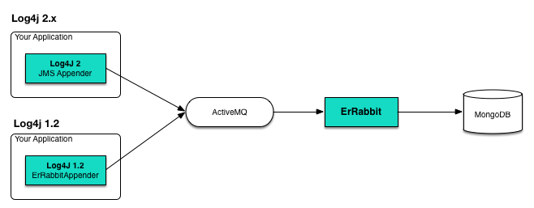
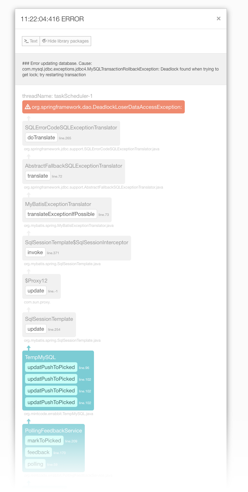

[](https://travis-ci.org/soleaf/ErRabbit)


# Introduction

ErRabbit(Error Rabbit) is useful error remote tracking service with Visual View.
Collecting by Log4j and ActiveMQ will make it easy compatible with other programs.

> Introduction Slide http://www.slideshare.net/ilhoahn50/errabbit

## What's a difference.

- RrRabbit aim to visualize Error logs
- Easy to integrate on exisiting java application.


> 한국어 설명은 [이곳](readme_kr.md)에 있습니다.

## Structure



## Web console screenshot

### Main

(+ Click to zoom)

- Managing rabbits(your applications)
- Grouping
- Clean logs
- View logs

### Log view

(+ Click to zoom)

- Explorer logs selected day
- Log level chart by time
- Filtering logs by level or class name

### Graphic Exception trace View (Log detail view) 

(+ Click to zoom)

- View Exception trace with graphical flow chart
- Show or hide library packages
- View original text log
- Search library package info with google search

### Console

(+ Click to zoom)

- Live feed all logs with WebSocket
- Same log view functions like log view page

### Analysis(Aggregation query)

(+ Click to zoom)

- Easy ggregating logs counts with custom grouping and filtering

### Batch Reprot
(+ Click to zoom)

- Daily report batch
- View all yesterday event logs on one page.

# Requirements

* Java 1.7 upper
* MongoDB 2
* ActiveMQ
* Configure Log4j

# Install and Using

1. Run MongoDB, ActiveMQ
1. Run ErRabbit
1. Make a Rabbit
1. Add JMS Appender to your application log4j2.xml

## Download release

https://github.com/soleaf/ErRabbit/releases

## Run Dependencies

ErRabbit uses MongoDB and ActiveMQ.

1. Run MongoDB
1. ActiveMQ server

## Run ErRabbit

### Setup settings.properties

- Edit `settings.properties`
- For MongoDB and ActiveMQ.. etc Set with your sever settings.

### Run

Run with command `sh run.sh` <br/>
Or directly command `java -jar [war filename] --spring.config.location=file:settings.properties`

## Login Console and add new Rabbit.

1. Connect Console with WebBrowser
    `http://localhost:[port]`
1. Your server port is 'server.port' on 'settings.properties' and login account is also on properties ('errabbit.security.admin.username, errabbit.security.admin.password').
1. Click 'add' menu on left side.
1. Make your new rabbit. (Rabbit is a namespace for tracking log like application artifact id).

## Make your application connect JMS

Choose method by your application log4j version.

* Log4j 1.2
* Log4j 2.x

### Setup for Log4j 1.2

Because Default JMS Appender on Log4j1 did not support queue, ErRabbit made a custom appender.
There is dependency for our custom appender.

#### Add Dependencies to maven `pom.xml`

```xml
<dependency>
    <groupId>org.mintcode.errabbit</groupId>
    <artifactId>log4j-apeender</artifactId>
    <version>1.0.0</version>
</dependency>
```

#### Setup log4j.xml

1. Declare 'errabbit' appender to `log4j.xml` with your ActiveMQ URL, userName, password, rabbitID

```xml
<?xml version="1.0" encoding="UTF-8"?>
<!DOCTYPE log4j:configuration SYSTEM "log4j.dtd">
<log4j:configuration xmlns:log4j="http://jakarta.apache.org/log4j/">

    <!-- Console view -->
    <appender name="console" class="org.apache.log4j.ConsoleAppender">
        <layout class="org.apache.log4j.PatternLayout">
            <param name="ConversionPattern" value="%d [%t] %p - %C{1}.%M(%L) | %m%n"/>
        </layout>
    </appender>

    <appender name="errabbit" class="org.mintcode.errabbit.log4j.Log4jAppender">
        <param name="host" value="tcp://localhost:61616"/>
        <param name="rabbitID" value="example"/>
        <layout class="org.apache.log4j.PatternLayout">
            <param name="ConversionPattern" value="%5p [%d{HH:mm:ss}] %m%n"/>
        </layout>
    </appender>

    <logger name="org.mintcode.errabbit.example">
        <level value="ERROR"/>
        <appender-ref ref="errabbit"/>
    </logger>

    <!-- Root Logger -->
    <root>
        <priority value="INFO" />
        <appender-ref ref="console" />
    </root>

</log4j:configuration>
```

CustomAppender's source : https://github.com/soleaf/ErRabbit-log4j-apeender

#### Use In Application Code

You can collect all kind of log(info, debug, trace .. etc). But, for your application performance,
use only as exception error logging.

1. Get Log4j Logger

```java
Logger logger = Logger.getLogger(getClass());
```

1. Log error with exception, Just type `logger.error([message],e)`. 
Another log level is same as your before code(like logger.info("hello");).

```java
try{
    int a[] = new int[2];
    System.out.println("Access element three :" + a[3]);
}
catch (Exception e){
    logger.error(e.getMessage(),e);
}
```

Example Project : https://github.com/soleaf/ErRabbit-Example-log4j1


### Setup for Log4j 2.x

#### Add Dependencies to maven `pom.xml`

```xml
<dependency>
    <groupId>javax.jms</groupId>
    <artifactId>jms</artifactId>
    <version>1.1</version>
</dependency>
<dependency>
    <groupId>org.apache.activemq</groupId>
    <artifactId>activemq-core</artifactId>
    <version>5.7.0</version>
</dependency>
```
and add repository for javax.jms (if maven can't find javax.jms)
```xml
 <repositories>
        <repository>
            <id>repository.jboss.org-public</id>
            <name>JBoss.org Maven repository</name>
            <url>https://repository.jboss.org/nexus/content/groups/public</url>
        </repository>
    </repositories>
```

#### Setup Log4j2

1. Declare 'JMS Appender' to `log4j2.xml` with your ActiveMQ URL, userName, password.
1. 'queueBindingName' should be 'errabbit'.
1. And add JMS Appender to Loggers.


```xml
<?xml version="1.0" encoding="UTF-8"?>
<Configuration status="info" name="MyApp" packages="org.mintcode.errabbit.example">
<Appenders>
    <JMS name="errabbit"
         queueBindingName="errabbit.report.example"
         factoryBindingName="ConnectionFactory"
         providerURL = "tcp://localhost:61616"
         userName = "sender"
         password = "senderpassword!"
            />
    <Console name="STDOUT" target="SYSTEM_OUT">
        <PatternLayout pattern="%m%n"/>
    </Console>
</Appenders>
<Loggers>
    <Logger name="org.mintcode.errabbit.example" level="error">
        <AppenderRef ref="errabbit"/>
    </Logger>
    <Root level="error">
        <AppenderRef ref="STDOUT"/>
    </Root>
</Loggers>
</Configuration>

```

#### Setup jndi.properties

1. Make `java/main/resource/jndi.properties`, and put same ActiveMQ settings(username, password, rabbitID).
1. queue.errabbit's value should be 'errabbit.report.[RabbitID]'.

```
java.naming.factory.initial = org.apache.activemq.jndi.ActiveMQInitialContextFactory
java.naming.provider.url = tcp://localhost:61616
queue.errabbit = errabbit.report.example
```

#### Use In Application Code

ErRabbit uses Log4j2 JMS Appender, and collects exceptions with other information logs.
You can collect all kind of log(info, debug, trace .. etc). But, for your application performance,
use only as exception error logging.

1. Get Log4j Logger

```java
Logger logger = LogManager.getLogger(getClass());
```

1. Log error with exception, Just type `logger.error([message],e)`

```java
try{
    int a[] = new int[2];
    System.out.println("Access element three :" + a[3]);
}
catch (Exception e){
    logger.error(e.getMessage(),e);
}
```

Example Project : https://github.com/soleaf/ErRabbit-Example-log4j2

#### Read System output
If you have legacy logs which use JVM System.class (printstackstrace, System.out, System.err and etc), you can configure your application to wrap them to Log4j. Check more info on this [wiki article](https://github.com/soleaf/ErRabbit/wiki/Read%20System.*%20output%20with%20ErRabbit%20and%20Log4j).

#### Using with logback
https://github.com/plinioasf/ErRabbit-logback-appender
https://github.com/plinioasf/ErRabbit-Example-logback

# Contribute

We welcome anyone want to improve ErRabbit.

- You can just fix and send pull request to me.
- Or talk about new feature through email(soleaf@gmail.com).
- Please comment as English at commit.

# Plan and Troubleshooting

Please read this wiki

https://github.com/soleaf/ErRabbit/wiki

# Special thanks

* :D 신현묵(Twitter @zetlos, supims@gmail.com)

# Awards

* Golden prize at 2015 OSS world challenge

# Talk with me

* Always ok! soleaf@gmail.com

# License

Apache 2.0 (http://www.apache.org/licenses/LICENSE-2.0)
