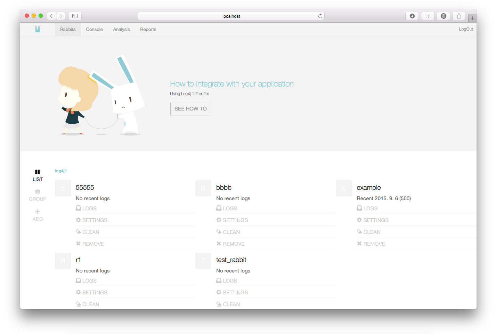
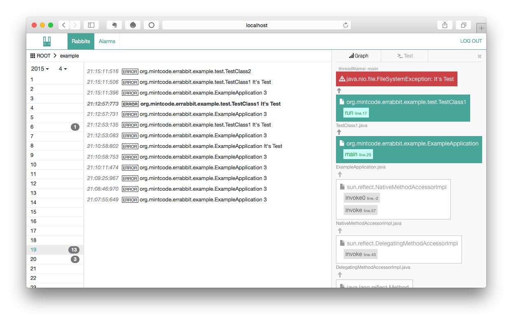

# Introduction

ErRabbit(Error Rabbit) is useful Error remote tracking service with Visual View.
Collecting by Using Log4j and ActiveMQ Easy Make it easy ,compatible other programs.
 




# Requirements 

* Java 1.7 upper
* MongoDB 2
* Active mq
* Log4j 2 in Your Application(Log Tracking Target).

# Install and Using

1. Run MongoDB, ActiveMQ
1. Run ErRabbit
1. Make a Rabbit
1. Add JMS Appender to your Application log4j2.xml

## Download release

https://github.com/soleaf/ErRabbit/releases

## Run Dependencies

ErRabbit is using MongoDB and ActiveMQ.

1. Run Mongodb
1. ActiveMQ server

## Run ErRabbit

### Setup settings.properties

- Edit `settings.properties`
- For MongoDB and ActiveMQ.. etc Set with your sever settings.

### Run

Run with command `sh run.sh` <br/>
Or directly command `java -jar [war filename] --spring.config.location=file:settings.properties`

## Login Console and add new Rabbit.

1. Connect Console with WebBrowser
    `http://localhost:[port]`
1. Your server port is 'server.port' on'settings.properties' And login account is also on properties ('errabbit.security.admin.username, errabbit.security.admin.password').
1. Click 'add' on left side menu.
1. Make your new rabbit. (Rabbit is a namespace for tracking log like application artifact id).

## Make your application connect JMS

### Add Dependencies to maven `pom.xml`

```
<dependency>
    <groupId>org.apache.logging.log4j</groupId>
    <artifactId>log4j-core</artifactId>
    <version>2.1</version>
</dependency>
<dependency>
    <groupId>javax.jms</groupId>
    <artifactId>jms</artifactId>
    <version>1.1</version>
</dependency>
<dependency>
    <groupId>org.apache.activemq</groupId>
    <artifactId>activemq-core</artifactId>
    <version>5.7.0</version>
</dependency>
```

### Setup log4j2

1. Declare 'JSM Appender' to `log4j2.xml` with your ActiveMQ URL, userName,Password And
'queueBindingName' should be 'errabbit.report.[RabbitID]'.
1. And Add JMS Appender to Loggers.


```
<?xml version="1.0" encoding="UTF-8"?>
<Configuration status="info" name="MyApp" packages="org.mintcode.errabbit.example">
<Appenders>
    <JMS name="errabbit"
         queueBindingName="errabbit.report.example"
         factoryBindingName="ConnectionFactory"
         providerURL = "tcp://localhost:61616"
         userName = "sender"
         password = "senderpassword!"
            />
</Appenders>
<Loggers>
    <Root level="error">
        <AppenderRef ref="errabbit"/>
    </Root>
</Loggers>
</Configuration>
```

### Setup jndi.properties

1. Make java/main/resource/jndi.properties, And Put it with above ActiveMQ settings.

```
java.naming.factory.initial = org.apache.activemq.jndi.ActiveMQInitialContextFactory
java.naming.provider.url = tcp://localhost:61616
queue.errabbit.report.example=errabbit.report.example
```

### Use In Application Code

ErRabbit is using log4j2 JMS Appender.
And collect Exception Information. With error log.
You cant log all (info, debug, trace .. etc). But, For your Application performance,
Use only as exception error logging.

 
1. Get Log4j Logger
 
```
Logger logger = LogManager.getLogger(getClass());
```

1. Log error. With Exception. Just `logger.error([message],e)`

```
try{
    int a[] = new int[2];
    System.out.println("Access element three :" + a[3]);
}
catch (Exception e){
    logger.error(e.getMessage(),e);
}
```

Example Project : https://github.com/soleaf/ErRabbit-Example-log4j2

# Development

You can make it better.

# Next : ToDo

* Alarm warning
* Statistics
* Integration with VCS
* Mobile Support