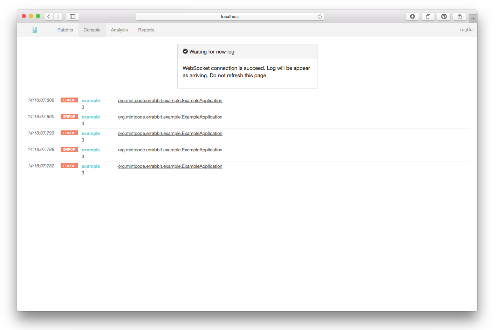
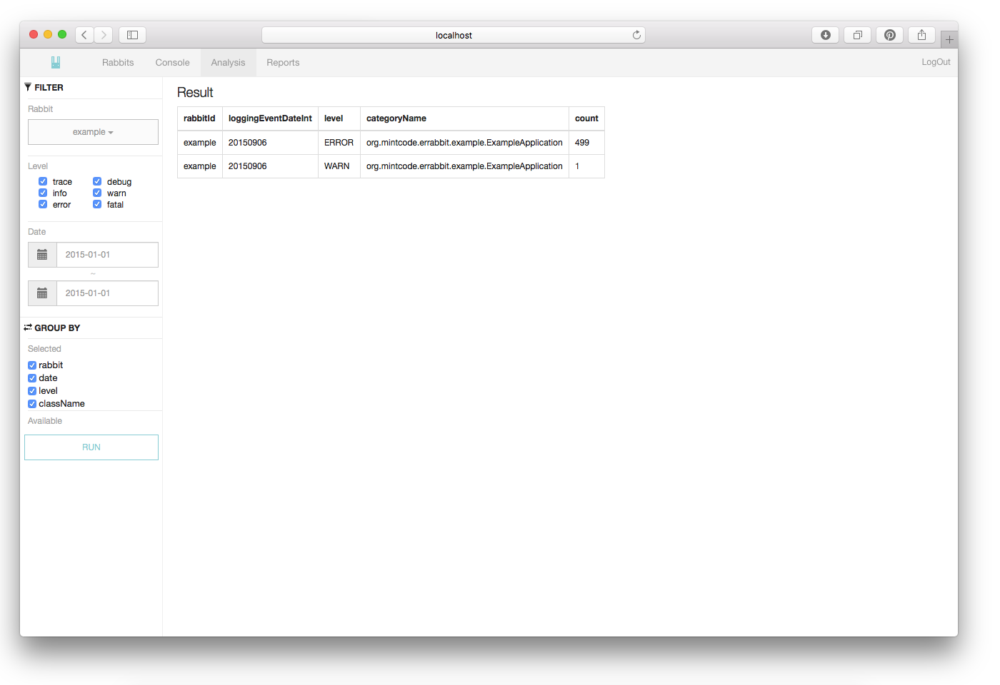
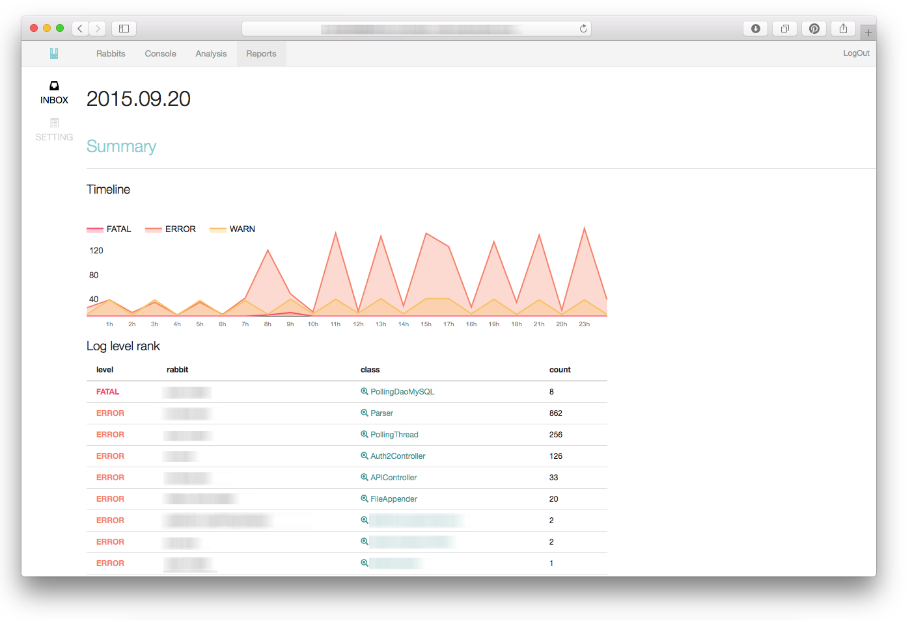

# 소개

ErRabbit(Error Rabbit)은 알아보기 어려운 java의 stack trace를 보기 쉽게 표현하고,
많은 서버들의 로그를 웹으로 쉽게 탐색할 수 있게 해줍니다.
많이 쓰는 로그 프로그램인 Log4j를 사용하여 ActiveMQ로 로그를 수집하기 때문에 이미 개발해놓은 프로그램에
적용하기도 쉽습니다.

> 소개 슬라이드 http://www.slideshare.net/ilhoahn50/errabbit

> [Here](readme.md) is Enlgish document.

## 구조


## 웹 콘솔 화면

### Main

- 레빗 관리(관리할 당신의 프로그램)
- 그룹관리
- 로그 비우기
- 로그 탐색

### Log view

- 특정일자의 로그를 탐색
- 시계열로 로그레벨의 그래프
- 클래스나 로그 레벨로 필터링

### Graphic Exception trace View (Log detail view) 

- Exception StackTrace를 그래픽으로 탐색
- 라이브러리 패키지를 숨김
- 원래의 텍스트 형태의 StacTrace 보기
- 라이브러리 클래스를 구글에서 검색

### Console

- Live feed all logs with WebSocket
- Same log view functions like log view page

### Analysis(Aggregation query)

- MongoDB의 Aggregate를 간단한 UI로 사용자의 임의로 로그의 통계를 쉽게 종합

### Batch Reprot

- 매일 전날의 종합 레포트

# 요구사항

* Java 1.7 upper
* MongoDB 2
* ActiveMQ
* Log4j1.2 or log4j 2 in your application(log tracking target).

# 설치및 설정방법

1. MongoDB, ActiveMQ 설치 및 실행
1. ErRabbit 실행
1. Rabbit 추가
1. Log4j 설정 

## 최신 릴리즈 다운로드

https://github.com/soleaf/ErRabbit/releases

## 의존성 설치 및 실행

ErRabbit은 ActiveMQ와 MongoDB를 필요로 합니다

1. MongoDB 실행
1. ActiveMQ 실행

## ErRabbit 설정 및 실행

### settings.properties 수정

- `settings.properties`를 수정
- MongoDB 또는 ActiveMQ에 대한 설정 및 콘솔 관리자 암호등을 적절하게 입력합니다.

### 실행

command `sh run.sh` 으로 실행<br/>
아니면 직접 command `java -jar [war filename] --spring.config.location=file:settings.properties` 으로 실행하면 됩니다.

## 웬 콘솔에 로그인 하고 레빗을 추가

1. 웹 브라우저를 켜고 설정한 포트로 접속합니다.
    `http://localhost:[port]`
1. 설정한 서버 포트는 'settings.properties'에서 속성 'server.port'이고 로그인 정보는 같은 파일에 있습니다('errabbit.security.admin.username, errabbit.security.admin.password').
1. 로그인 하면 뜨는 Rabbits에서 왼쪽에 Add를 누릅니다
1. 원하시는 설정대로 레빗을 추가합니다.

## 연결하고자 하는 프로그램에 log4j JMS Appender를 설정합니다

당신이 사용하고있는 프로그램의 log4j 버전에 따라 조금 다릅니다

* Log4j 1.2
* Log4j 2.x

### Log4j 1.2 버전에서의 사용법입니다

1.2는 JMS Appender에서 큐를 기본으로 지원하지 않기 때문에 ErRabbit이 사용할 전용 Custom Appender를 개발하였습니다

####  `pom.xml`에 아래와 같이 의존성을 추가

```xml
<dependency>
    <groupId>org.mintcode.errabbit</groupId>
    <artifactId>log4j-apeender</artifactId>
    <version>1.0.0</version>
</dependency>
```

#### log4j.xml 설정

1. `log4j.xml`에 errabbit appender를 선언하ㄱ activeMQ URL, userName, password, rabbitID을 설정합니다.

```xml
<?xml version="1.0" encoding="UTF-8"?>
<!DOCTYPE log4j:configuration SYSTEM "log4j.dtd">
<log4j:configuration xmlns:log4j="http://jakarta.apache.org/log4j/">

    <!-- Console view -->
    <appender name="console" class="org.apache.log4j.ConsoleAppender">
        <layout class="org.apache.log4j.PatternLayout">
            <param name="ConversionPattern" value="%d [%t] %p - %C{1}.%M(%L) | %m%n"/>
        </layout>
    </appender>

    <appender name="errabbit" class="org.mintcode.errabbit.log4j.Log4jAppender">
        <param name="host" value="tcp://localhost:61616"/>
        <param name="rabbitID" value="example"/>
        <layout class="org.apache.log4j.PatternLayout">
            <param name="ConversionPattern" value="%5p [%d{HH:mm:ss}] %m%n"/>
        </layout>
    </appender>

    <logger name="org.mintcode.errabbit.example">
        <level value="ERROR"/>
        <appender-ref ref="errabbit"/>
    </logger>

    <!-- Root Logger -->
    <root>
        <priority value="INFO" />
        <appender-ref ref="console" />
    </root>

</log4j:configuration>
```

CustomAppender의 소스는 깃헙에 공개되어있습니다 : https://github.com/soleaf/ErRabbit-log4j-apeender

#### 프로그램에서 사용

모든 종류의 로그 레벨을 쓸수 있습니다만, 당신의 프로그램의 퍼포먼스를 위해서 warn 이상의 레벨을 사용하길 권장합니다.

1. Log4j Logger 획득

```java
Logger logger = Logger.getLogger(getClass());
```

1. Exception을 캐시하고 `logger.error([message],e)`로 처리합니다. 이게 끝입니다 일반 로그는 평소에 쓰시던대로 써주시면됩니다.

```java
try{
    int a[] = new int[2];
    System.out.println("Access element three :" + a[3]);
}
catch (Exception e){
    logger.error(e.getMessage(),e);
}
```

예제 프로젝트 : https://github.com/soleaf/ErRabbit-Example-log4j1


### Log4j 2.x 에서 사용방법

#### `pom.xml`에 의존성을 추가합니다

log4j가 이미 추가 되어있다는 것을 가정합니다.

```xml
<dependency>
    <groupId>javax.jms</groupId>
    <artifactId>jms</artifactId>
    <version>1.1</version>
</dependency>
<dependency>
    <groupId>org.apache.activemq</groupId>
    <artifactId>activemq-core</artifactId>
    <version>5.7.0</version>
</dependency>
```

javax.jms를 메이븐에서 찾지 못한다고 나타나면 아래처럼 레포지토리를 추가해주세요.
```xml
 <repositories>
        <repository>
            <id>repository.jboss.org-public</id>
            <name>JBoss.org Maven repository</name>
            <url>https://repository.jboss.org/nexus/content/groups/public</url>
        </repository>
    </repositories>
```


#### Log4j2 설정

1. 'JMS Appender'를 `log4j2.xml`에 ActiveMQ URL, userName, password를 설정합니다
1. 'queueBindingName'을 'errabbit'으로 지정합니다.
1.  JMS Appender를 looger로 추가합니다.


```xml
<?xml version="1.0" encoding="UTF-8"?>
<Configuration status="info" name="MyApp" packages="org.mintcode.errabbit.example">
<Appenders>
    <JMS name="errabbit"
         queueBindingName="errabbit"
         factoryBindingName="ConnectionFactory"
         providerURL = "tcp://localhost:61616"
         userName = "sender"
         password = "senderpassword!"
            />
    <Console name="STDOUT" target="SYSTEM_OUT">
        <PatternLayout pattern="%m%n"/>
    </Console>
</Appenders>
<Loggers>
    <Logger name="org.mintcode.errabbit.example" level="error">
        <AppenderRef ref="errabbit"/>
    </Logger>
    <Root level="error">
        <AppenderRef ref="STDOUT"/>
    </Root>
</Loggers>
</Configuration>

```

#### jndi.properties를 설정합니다

log4j2 JMSAppender는 jndi.properties를 필요로 합니다. 다음과 같이 합니다

1. 프로젝트 경로에  `java/main/resource/jndi.properties` 를 생성하고, ActiveMQ settings(username, password, rabbitID)를 기록합니다.
1. queue.errabbit의 값은 'errabbit.report.[RabbitID]'으로 합니다.

```
java.naming.factory.initial = org.apache.activemq.jndi.ActiveMQInitialContextFactory
java.naming.provider.url = tcp://localhost:61616
queue.errabbit = errabbit.report.example
```

#### 프로그램에서 사용하기

모든 종류의 로그 레벨을 쓸수 있습니다만, 당신의 프로그램의 퍼포먼스를 위해서 warn 이상의 레벨을 사용하길 권장합니다.

1. Get Log4j Logger

```java
Logger logger = LogManager.getLogger(getClass());
```

1. Exception을 캐치하고 `logger.error([message],e)`로 처리합니다. 이게 끝입니다 일반 로그는 평소에 쓰시던대로 써주시면됩니다.

```java
try{
    int a[] = new int[2];
    System.out.println("Access element three :" + a[3]);
}
catch (Exception e){
    logger.error(e.getMessage(),e);
}
```

예제 프로젝트 : https://github.com/soleaf/ErRabbit-Example-log4j2

# 다음계획 및 문제해결

다음 위키를 확인해주세요.
https://github.com/soleaf/ErRabbit/wiki

# 멘토 & 스페셜 떙스!

* :D 신현묵(Twitter @zetlos, supims@gmail.com)

# 수상내역

* 2015 공개소프트웨어 개발자 대회, 금상

# 라이센스

Apache 2.0 (http://www.apache.org/licenses/LICENSE-2.0)
